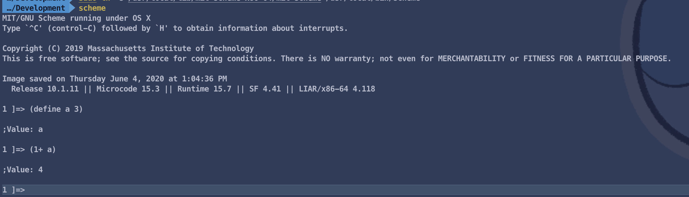

# Install MIT/GNU Scheme

1. Download [MIT/GNU Scheme](https://ftp.gnu.org/gnu/mit-scheme/stable.pkg/10.1.11/mit-scheme-10.1.11-x86-64.dmg)
2. Double click the .dmg file, and you'll get this window, in which you should drag the "MIT/GNU Scheme 10.1.11" file into the Applications folder.

3.For the 64-bit version, run this command:

```shell
sudo ln -s /Applications/MIT:GNU\ Scheme\ 10.1.11.app/Contents/Resources /usr/local/lib/mit-scheme-x86-64
```

Then enter your administrator password and run this command:

```shell
sudo ln -s /usr/local/lib/mit-scheme-x86-64/mit-scheme /usr/local/bin/scheme
```


