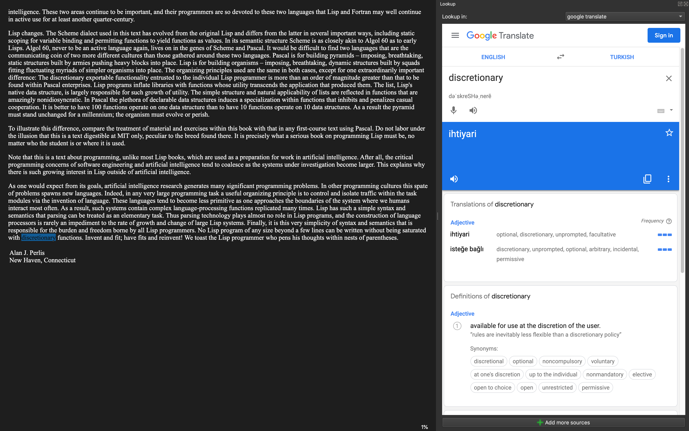

# Calibre Google Translate Settings

1. Open calibre and one epub.
2. Select one word and click double.
3. Click **"Lookup/search word"** from the top drop down menu

    

4. Click **"+ Add more sources"** from the right menu
5. Click **"+ Add"** from the popup menu

    

6. Give a name, add following url to **"URL"** and Click **"OK"**

    ```https
    https://translate.google.com/#view=home&op=translate&sl=en&tl=tr&text={word}
    ```

    

7. Now it will be translated when you select and double click something.

    